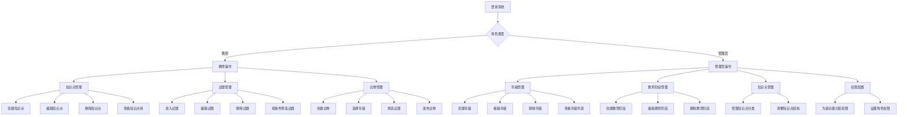
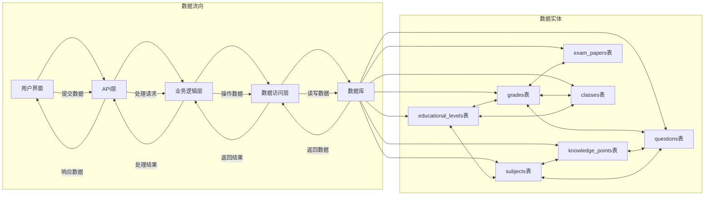

# 知识点与年级管理功能需求分析与实现方案

## 1. 需求分析

### 1.1 功能需求

1. **知识点管理**：
   - 实现知识点的增删改查功能
   - 支持最多5级的层级结构管理
   - 与学科关联，按学科组织知识点
   - 支持树形结构展示和编辑

2. **年级管理**：
   - 实现年级的增删改查功能
   - 覆盖幼儿园到高中的所有年级
   - 与教育阶段关联，按阶段分类年级
   - 复用现有的grades表数据

3. **试题管理**：
   - 实现试题的增删改查功能
   - 支持多种题型（选择题、填空题、简答题等）
   - 与年级、知识点、学科关联
   - 支持难度级别设置

4. **试卷管理增强**：
   - 为试卷添加年级属性
   - 支持按年级筛选试卷
   - 与试题管理集成

5. **权限管理集成**：
   - 为新功能模块分配权限点
   - 支持基于角色的权限控制
   - 与现有权限系统无缝集成

### 1.2 业务场景

1. **教师场景**：
   - 创建知识点体系，按学科和年级组织，支持最多5级层级
   - 录入试题时，选择对应的知识点、年级和学科
   - 组卷时，选择目标年级，系统自动筛选适合的试题
   - 查看试题的知识点分布和年级分布

2. **管理员场景**：
   - 维护年级体系，与教育阶段关联
   - 管理知识点分类，确保知识点结构合理
   - 监控知识点和年级的使用情况
   - 配置新功能模块的权限

### 1.3 业务流程图



### 1.4 数据流图



### 1.3 数据关系

- **年级**：作为基础数据，与多个实体关联
- **知识点**：与试题关联，形成知识体系
- **试题**：与知识点、年级关联
- **试卷**：与年级关联，包含多个试题

### 1.5 系统现有实现

通过对系统代码的分析，发现系统已经具备以下相关功能：

1. **年级相关**：
   - 系统已存在`grades`表（从`ClassMapper.java`中可以看到）
   - `ClassEntity`中已包含`gradeId`字段，与年级表关联
   - `ClassMapper`中已实现`selectActiveGrades()`方法，用于获取活跃的年级列表

2. **教育阶段相关**：
   - 系统已存在`educational_levels`表（从`SubjectMapper.java`和`ClassMapper.java`中可以看到）
   - `SubjectEntity`和`ClassEntity`中都已包含`educationalLevelId`字段，与教育阶段表关联
   - `SubjectMapper`中已实现`selectActiveLevels()`方法，用于获取活跃的教育阶段列表

3. **权限管理**：
   - 系统已实现完整的权限管理体系，使用`@PermissionRequired`注解进行权限控制
   - 权限管理包括菜单、按钮和操作类型的控制

4. **学科管理**：
   - 系统已实现完整的学科管理功能，包括增删改查操作
   - 学科管理与班级、教育阶段等模块已集成

5. **班级管理**：
   - 系统已实现完整的班级管理功能，包括增删改查操作
   - 班级与年级、教育阶段等模块已集成

### 1.6 字段验证规则

| 实体 | 字段 | 验证规则 |
|------|------|----------|
| **GradeEntity** | name | 非空，长度1-50 |
| | level | 非空，枚举值：幼儿园/小学/初中/高中 |
| | code | 非空，唯一，长度1-20 |
| | sortOrder | 非空，正整数 |
| | status | 非空，枚举值：ACTIVE/INACTIVE |
| **KnowledgePointEntity** | name | 非空，长度1-100 |
| | code | 非空，唯一，长度1-50 |
| | parentId | 可为空，必须是已存在的知识点ID |
| | subjectId | 非空，必须是已存在的学科ID |
| | status | 非空，枚举值：ACTIVE/INACTIVE |
| **QuestionEntity** | content | 非空，长度1-1000 |
| | type | 非空，枚举值：选择题/填空题/简答题/判断题 |
| | difficulty | 非空，枚举值：EASY/MEDIUM/HARD |
| | score | 非空，正整数 |
| | answer | 非空，长度1-500 |
| | subjectId | 非空，必须是已存在的学科ID |
| | gradeId | 非空，必须是已存在的年级ID |
| | knowledgePointId | 非空，必须是已存在的知识点ID |
| | status | 非空，枚举值：ACTIVE/INACTIVE |
| **ExamPaper** | gradeId | 非空，必须是已存在的年级ID |

## 2. 技术方案

### 2.1 数据模型设计

#### 2.1.1 系统现有实体

**1. 年级实体 (GradeEntity)** - 已存在
| 字段名 | 类型 | 描述 |
|-------|------|------|
| id | Long | 主键 |
| name | String | 年级名称（如：一年级、初二） |
| level | String | 教育阶段（幼儿园/小学/初中/高中） |
| code | String | 年级编码（如：GRADE_1, HIGH_3） |
| sortOrder | Integer | 排序顺序 |
| status | String | 状态 |
| createdAt | LocalDateTime | 创建时间 |
| updatedAt | LocalDateTime | 更新时间 |
| createdBy | String | 创建人 |
| updatedBy | String | 更新人 |

**2. 教育阶段实体 (EducationalLevelEntity)** - 已存在
| 字段名 | 类型 | 描述 |
|-------|------|------|
| id | Long | 主键 |
| name | String | 教育阶段名称（如：幼儿园、小学、初中、高中） |
| code | String | 教育阶段编码 |
| status | String | 状态 |
| createdAt | LocalDateTime | 创建时间 |
| updatedAt | LocalDateTime | 更新时间 |
| createdBy | String | 创建人 |
| updatedBy | String | 更新人 |

#### 2.1.2 新增实体

**1. 知识点实体 (KnowledgePointEntity)**
| 字段名 | 类型 | 描述 | 验证规则 |
|-------|------|------|----------|
| id | Long | 主键 | 自增 |
| name | String | 知识点名称 | 非空，长度1-100 |
| code | String | 知识点编码 | 非空，唯一，长度1-50 |
| parentId | Long | 父知识点ID（支持层级结构） | 可为空，必须是已存在的知识点ID，层级深度≤5 |
| subjectId | Long | 所属学科ID | 非空，必须是已存在的学科ID |
| description | String | 知识点描述 | 可为空，长度≤500 |
| status | String | 状态 | 非空，枚举值：ACTIVE/INACTIVE |
| createdAt | LocalDateTime | 创建时间 | 自动生成 |
| updatedAt | LocalDateTime | 更新时间 | 自动更新 |
| createdBy | String | 创建人 | 自动填充 |
| updatedBy | String | 更新人 | 自动填充 |

**2. 试题实体 (QuestionEntity)**
| 字段名 | 类型 | 描述 | 验证规则 |
|-------|------|------|----------|
| id | Long | 主键 | 自增 |
| content | String | 试题内容 | 非空，长度1-1000 |
| type | String | 试题类型 | 非空，枚举值：选择题/填空题/简答题/判断题 |
| difficulty | String | 难度级别 | 非空，枚举值：EASY/MEDIUM/HARD |
| score | Integer | 分值 | 非空，正整数 |
| answer | String | 答案 | 非空，长度1-500 |
| analysis | String | 解析 | 可为空，长度≤1000 |
| subjectId | Long | 所属学科ID | 非空，必须是已存在的学科ID |
| gradeId | Long | 所属年级ID | 非空，必须是已存在的年级ID |
| knowledgePointId | Long | 所属知识点ID | 非空，必须是已存在的知识点ID |
| status | String | 状态 | 非空，枚举值：ACTIVE/INACTIVE |
| createdAt | LocalDateTime | 创建时间 | 自动生成 |
| updatedAt | LocalDateTime | 更新时间 | 自动更新 |
| createdBy | String | 创建人 | 自动填充 |
| updatedBy | String | 更新人 | 自动填充 |


#### 2.1.3 修改现有实体

**1. 试卷实体 (ExamPaper)**
| 字段名 | 类型 | 描述 | 验证规则 |
|-------|------|------|----------|
| gradeId | Long | 所属年级ID（新增） | 非空，必须是已存在的年级ID |

**2. 学科实体 (SubjectEntity)** - 已存在
| 字段名 | 类型 | 描述 |
|-------|------|------|
| educationalLevelId | Long | 教育阶段ID（已存在，可与年级的level关联） |

**3. 班级实体 (ClassEntity)** - 已存在
| 字段名 | 类型 | 描述 |
|-------|------|------|
| gradeId | Long | 所属年级ID（已存在） |
| educationalLevelId | Long | 教育阶段ID（已存在） |

### 2.2 架构设计

#### 2.2.1 后端架构

1. **Controller层**：
   - GradeController：处理年级相关请求，集成现有grades表数据
   - KnowledgePointController：处理知识点相关请求，支持树形结构
   - QuestionController：处理试题相关请求
   - ExamPaperController：处理试卷相关请求，增加年级关联

2. **Service层**：
   - GradeService：年级业务逻辑，复用现有数据
   - KnowledgePointService：知识点业务逻辑，支持层级管理
   - QuestionService：试题业务逻辑
   - ExamPaperService：试卷业务逻辑，增加年级关联

3. **Mapper层**：
   - GradeMapper：年级数据访问，复用现有方法
   - KnowledgePointMapper：知识点数据访问，支持树形查询
   - QuestionMapper：试题数据访问
   - ExamPaperMapper：试卷数据访问，增加年级关联查询

#### 2.2.2 前端架构

1. **页面组件**：
   - 年级管理页面
   - 知识点管理页面
   - 试题管理页面
   - 试卷管理页面（修改，增加年级选择）

2. **API调用**：
   - 年级相关API
   - 知识点相关API
   - 试题相关API

### 2.3 数据库设计

#### 2.3.1 系统现有表结构

**1. `grades`表** - 已存在
```sql
CREATE TABLE `grades` (
  `id` bigint(20) NOT NULL AUTO_INCREMENT,
  `name` varchar(50) NOT NULL COMMENT '年级名称',
  `level` varchar(20) NOT NULL COMMENT '教育阶段',
  `code` varchar(20) NOT NULL COMMENT '年级编码',
  `sort_order` int(11) DEFAULT NULL COMMENT '排序顺序',
  `status` varchar(20) DEFAULT 'ACTIVE' COMMENT '状态',
  `created_at` datetime DEFAULT CURRENT_TIMESTAMP COMMENT '创建时间',
  `updated_at` datetime DEFAULT CURRENT_TIMESTAMP ON UPDATE CURRENT_TIMESTAMP COMMENT '更新时间',
  `created_by` varchar(50) DEFAULT NULL COMMENT '创建人',
  `updated_by` varchar(50) DEFAULT NULL COMMENT '更新人',
  PRIMARY KEY (`id`),
  UNIQUE KEY `uk_code` (`code`)
) ENGINE=InnoDB DEFAULT CHARSET=utf8mb4 COMMENT='年级表';
```

**2. `educational_levels`表** - 已存在
```sql
CREATE TABLE `educational_levels` (
  `id` bigint(20) NOT NULL AUTO_INCREMENT,
  `name` varchar(50) NOT NULL COMMENT '教育阶段名称',
  `code` varchar(20) NOT NULL COMMENT '教育阶段编码',
  `status` varchar(20) DEFAULT 'ACTIVE' COMMENT '状态',
  `created_at` datetime DEFAULT CURRENT_TIMESTAMP COMMENT '创建时间',
  `updated_at` datetime DEFAULT CURRENT_TIMESTAMP ON UPDATE CURRENT_TIMESTAMP COMMENT '更新时间',
  `created_by` varchar(50) DEFAULT NULL COMMENT '创建人',
  `updated_by` varchar(50) DEFAULT NULL COMMENT '更新人',
  PRIMARY KEY (`id`),
  UNIQUE KEY `uk_code` (`code`)
) ENGINE=InnoDB DEFAULT CHARSET=utf8mb4 COMMENT='教育阶段表';
```

#### 2.3.2 新增表结构

**1. `knowledge_points`表**
```sql
CREATE TABLE `knowledge_points` (
  `id` bigint(20) NOT NULL AUTO_INCREMENT,
  `name` varchar(100) NOT NULL COMMENT '知识点名称',
  `code` varchar(50) NOT NULL COMMENT '知识点编码',
  `parent_id` bigint(20) DEFAULT NULL COMMENT '父知识点ID',
  `subject_id` bigint(20) DEFAULT NULL COMMENT '所属学科ID',
  `description` varchar(500) DEFAULT NULL COMMENT '知识点描述',
  `status` varchar(20) DEFAULT 'ACTIVE' COMMENT '状态',
  `created_at` datetime DEFAULT CURRENT_TIMESTAMP COMMENT '创建时间',
  `updated_at` datetime DEFAULT CURRENT_TIMESTAMP ON UPDATE CURRENT_TIMESTAMP COMMENT '更新时间',
  `created_by` varchar(50) DEFAULT NULL COMMENT '创建人',
  `updated_by` varchar(50) DEFAULT NULL COMMENT '更新人',
  PRIMARY KEY (`id`),
  UNIQUE KEY `uk_code` (`code`),
  KEY `idx_parent_id` (`parent_id`),
  KEY `idx_subject_id` (`subject_id`),
  CONSTRAINT `fk_knowledge_point_subject` FOREIGN KEY (`subject_id`) REFERENCES `subjects` (`id`)
) ENGINE=InnoDB DEFAULT CHARSET=utf8mb4 COMMENT='知识点表';
```

**2. `questions`表**
```sql
CREATE TABLE `questions` (
  `id` bigint(20) NOT NULL AUTO_INCREMENT,
  `content` text NOT NULL COMMENT '试题内容',
  `type` varchar(20) NOT NULL COMMENT '试题类型',
  `difficulty` varchar(20) DEFAULT NULL COMMENT '难度级别',
  `score` int(11) DEFAULT NULL COMMENT '分值',
  `answer` text COMMENT '答案',
  `analysis` text COMMENT '解析',
  `subject_id` bigint(20) DEFAULT NULL COMMENT '所属学科ID',
  `grade_id` bigint(20) DEFAULT NULL COMMENT '所属年级ID',
  `knowledge_point_id` bigint(20) DEFAULT NULL COMMENT '所属知识点ID',
  `status` varchar(20) DEFAULT 'ACTIVE' COMMENT '状态',
  `created_at` datetime DEFAULT CURRENT_TIMESTAMP COMMENT '创建时间',
  `updated_at` datetime DEFAULT CURRENT_TIMESTAMP ON UPDATE CURRENT_TIMESTAMP COMMENT '更新时间',
  `created_by` varchar(50) DEFAULT NULL COMMENT '创建人',
  `updated_by` varchar(50) DEFAULT NULL COMMENT '更新人',
  PRIMARY KEY (`id`),
  KEY `idx_subject_id` (`subject_id`),
  KEY `idx_grade_id` (`grade_id`),
  KEY `idx_knowledge_point_id` (`knowledge_point_id`),
  CONSTRAINT `fk_question_subject` FOREIGN KEY (`subject_id`) REFERENCES `subjects` (`id`),
  CONSTRAINT `fk_question_grade` FOREIGN KEY (`grade_id`) REFERENCES `grades` (`id`),
  CONSTRAINT `fk_question_knowledge_point` FOREIGN KEY (`knowledge_point_id`) REFERENCES `knowledge_points` (`id`)
) ENGINE=InnoDB DEFAULT CHARSET=utf8mb4 COMMENT='试题表';
```


#### 2.3.2 修改现有表结构

**1. 修改`exam_papers`表**
```sql
ALTER TABLE `exam_papers` ADD COLUMN `grade_id` bigint(20) DEFAULT NULL COMMENT '所属年级ID',
ADD KEY `idx_grade_id` (`grade_id`),
ADD CONSTRAINT `fk_exam_paper_grade` FOREIGN KEY (`grade_id`) REFERENCES `grades` (`id`);
```

### 2.4 接口设计

#### 2.4.1 年级管理接口

| API路径 | 方法 | 功能描述 | 请求体 (JSON) | 成功响应 (200 OK) |
|--------|------|----------|--------------|-------------------|
| `/api/grades` | GET | 获取年级列表 | N/A | `{"code":"0000","msg":"success","data":{"list":[{"id":1,"name":"一年级","level":"小学","code":"GRADE_1",...}],"total":12}}` |
| `/api/grades` | POST | 创建年级 | `{"name":"一年级","level":"小学","code":"GRADE_1","sortOrder":1}` | `{"code":"0000","msg":"success","data":{"id":1,"name":"一年级",...}}` |
| `/api/grades/{id}` | GET | 获取年级详情 | N/A | `{"code":"0000","msg":"success","data":{"id":1,"name":"一年级",...}}` |
| `/api/grades/{id}` | PUT | 更新年级 | `{"name":"一年级","level":"小学","code":"GRADE_1","sortOrder":1}` | `{"code":"0000","msg":"success","data":{"id":1,"name":"一年级",...}}` |
| `/api/grades/{id}` | DELETE | 删除年级 | N/A | `{"code":"0000","msg":"success","data":null}` |

#### 2.4.2 知识点管理接口

| API路径 | 方法 | 功能描述 | 请求体 (JSON) | 成功响应 (200 OK) |
|--------|------|----------|--------------|-------------------|
| `/api/knowledge-points` | GET | 获取知识点列表 | N/A | `{"code":"0000","msg":"success","data":{"list":[{"id":1,"name":"加减法","code":"MATH_ADD_SUB",...}],"total":50}}` |
| `/api/knowledge-points` | POST | 创建知识点 | `{"name":"加减法","code":"MATH_ADD_SUB","parentId":null,"subjectId":1}` | `{"code":"0000","msg":"success","data":{"id":1,"name":"加减法",...}}` |
| `/api/knowledge-points/{id}` | GET | 获取知识点详情 | N/A | `{"code":"0000","msg":"success","data":{"id":1,"name":"加减法",...}}` |
| `/api/knowledge-points/{id}` | PUT | 更新知识点 | `{"name":"加减法","code":"MATH_ADD_SUB","parentId":null,"subjectId":1}` | `{"code":"0000","msg":"success","data":{"id":1,"name":"加减法",...}}` |
| `/api/knowledge-points/{id}` | DELETE | 删除知识点 | N/A | `{"code":"0000","msg":"success","data":null}` |
| `/api/knowledge-points/tree` | GET | 获取知识点树结构 | N/A | `{"code":"0000","msg":"success","data":[{"id":1,"name":"数学","children":[{"id":2,"name":"加减法",...}]}]}` |

#### 2.4.3 试题管理接口

| API路径 | 方法 | 功能描述 | 请求体 (JSON) | 成功响应 (200 OK) |
|--------|------|----------|--------------|-------------------|
| `/api/questions` | GET | 获取试题列表 | N/A | `{"code":"0000","msg":"success","data":{"list":[{"id":1,"content":"1+1=?","type":"选择题",...}],"total":100}}` |
| `/api/questions` | POST | 创建试题 | `{"content":"1+1=?","type":"选择题","difficulty":"EASY","score":5,"answer":"A","analysis":"1+1=2","subjectId":1,"gradeId":1,"knowledgePointId":2}` | `{"code":"0000","msg":"success","data":{"id":1,"content":"1+1=?",...}}` |
| `/api/questions/{id}` | GET | 获取试题详情 | N/A | `{"code":"0000","msg":"success","data":{"id":1,"content":"1+1=?",...}}` |
| `/api/questions/{id}` | PUT | 更新试题 | `{"content":"1+1=?","type":"选择题","difficulty":"EASY","score":5,"answer":"A","analysis":"1+1=2","subjectId":1,"gradeId":1,"knowledgePointId":2}` | `{"code":"0000","msg":"success","data":{"id":1,"content":"1+1=?",...}}` |
| `/api/questions/{id}` | DELETE | 删除试题 | N/A | `{"code":"0000","msg":"success","data":null}` |

## 3. 实现计划

### 3.1 后端实现步骤

1. **创建实体类**：
   - `GradeEntity.java`：复用现有grades表结构
   - `KnowledgePointEntity.java`：支持层级结构，最大深度5级
   - `QuestionEntity.java`：与年级、知识点、学科关联
   - 修改 `ExamPaper.java` 添加 `gradeId` 字段

2. **创建Mapper接口**：
   - `GradeMapper.java`：复用现有selectActiveGrades()方法，添加CRUD方法
   - `KnowledgePointMapper.java`：支持树形查询和层级验证
   - `QuestionMapper.java`：支持多条件查询
   - `ExamPaperMapper.java`：增加年级关联查询

3. **创建Service接口及实现**：
   - `GradeService.java` 及 `GradeServiceImpl.java`：年级业务逻辑
   - `KnowledgePointService.java` 及 `KnowledgePointServiceImpl.java`：知识点业务逻辑，实现层级深度验证
   - `QuestionService.java` 及 `QuestionServiceImpl.java`：试题业务逻辑
   - `ExamPaperService.java` 及 `ExamPaperServiceImpl.java`：试卷业务逻辑，增加年级关联

4. **创建Controller**：
   - `GradeController.java`：年级相关接口，使用@PermissionRequired注解
   - `KnowledgePointController.java`：知识点相关接口，支持树形结构API
   - `QuestionController.java`：试题相关接口
   - `ExamPaperController.java`：试卷相关接口，增加年级选择

5. **权限配置**：
   - 为新增的功能模块配置相应的权限点
   - 使用现有的@PermissionRequired注解进行权限控制
   - 在权限管理界面添加新功能的权限配置

6. **数据库迁移**：
   - 创建knowledge_points表
   - 创建questions表
   - 修改exam_papers表，添加grade_id字段
   - 确保与现有表的外键关联正确

### 3.2 前端实现步骤

1. **创建页面组件**：
   - 年级管理页面：复用现有grades表数据，实现CRUD操作
   - 知识点管理页面：支持树形结构展示和编辑，限制最大层级5级
   - 试题管理页面：支持多条件筛选，与年级、知识点关联

2. **修改现有页面**：
   - 试卷管理页面：增加年级选择功能
   - 权限管理页面：添加新功能的权限配置

3. **API调用**：
   - 实现前端API调用服务，与后端接口对接
   - 集成到页面组件中，实现完整的业务流程

4. **前端验证**：
   - 实现表单验证，与后端验证规则保持一致
   - 实现知识点层级深度验证
   - 实现关联数据的有效性验证

### 3.3 测试计划

1. **单元测试**：
   - 测试各Service方法
   - 测试Controller接口

2. **集成测试**：
   - 测试完整的业务流程
   - 测试关联关系的正确性

3. **前端测试**：
   - 测试页面功能
   - 测试API调用

## 4. 业务闭环

### 4.1 知识点管理流程

1. **创建知识点**：管理员或教师登录系统，进入知识点管理页面，创建知识点，设置名称、编码、所属学科等信息。
2. **组织知识点结构**：通过设置父知识点ID，构建知识点的层级结构。
3. **维护知识点**：对知识点进行编辑、删除等操作。
4. **使用知识点**：在录入试题时，选择对应的知识点。

### 4.2 年级管理流程

1. **初始化年级**：系统初始化时，预置幼儿园到高中的所有年级。
2. **维护年级**：管理员可以对年级进行编辑、删除等操作。
3. **使用年级**：在录入试题和创建试卷时，选择对应的年级。

### 4.3 试题管理流程

1. **创建试题**：教师登录系统，进入试题管理页面，录入试题内容、类型、难度、分值、答案、解析等信息，并关联年级和知识点。
2. **维护试题**：对试题进行编辑、删除等操作。
3. **使用试题**：在组卷时，系统根据选择的年级和知识点筛选适合的试题。

### 4.4 试卷管理流程

1. **创建试卷**：教师登录系统，进入试卷管理页面，设置试卷名称、所属学科、年级等信息。
2. **选择试题**：系统根据选择的年级和知识点，筛选适合的试题，教师可以从中选择或手动录入试题。
3. **发布试卷**：完成试卷创建后，发布试卷供学生使用。

## 5. 技术要点

1. **知识点层级结构**：
   - 使用递归查询实现知识点的树状结构展示和管理
   - 限制最大层级深度为5级，确保系统性能
   - 实现层级深度验证，防止无限层级

2. **年级体系设计**：
   - 合理设计年级编码和排序，确保年级的逻辑顺序
   - 与教育阶段关联，实现按阶段分类年级
   - 复用现有grades表数据，确保数据一致性

3. **关联关系管理**：
   - 通过外键约束确保数据一致性
   - 在业务逻辑中处理关联关系的影响，如删除年级时的级联处理
   - 实现关联数据的有效性验证

4. **前端交互**：
   - 实现知识点树状选择、年级级联选择等交互功能
   - 支持树形结构的拖拽调整
   - 实现表单验证和错误提示

5. **性能优化**：
   - 对高频查询进行优化，如知识点树结构的缓存
   - 实现分页加载，减少一次性加载大量数据
   - 优化数据库查询，添加适当的索引

6. **权限系统集成**：
   - 使用现有的@PermissionRequired注解进行权限控制
   - 为新功能模块分配合理的权限点
   - 确保权限控制的一致性和安全性

## 6. 风险评估与应对措施

| 风险 | 影响 | 应对措施 |
|------|------|----------|
| **数据迁移** | 修改现有表结构可能影响现有数据 | 1. 采用ALTER TABLE而非重建表<br>2. 提前备份数据<br>3. 分阶段执行迁移<br>4. 进行迁移测试 |
| **关联关系** | 新增的关联关系可能影响现有业务流程 | 1. 充分测试关联关系的影响<br>2. 实现合理的级联处理逻辑<br>3. 提供数据修复方案 |
| **前端适配** | 现有前端页面需要适配新的功能 | 1. 采用增量开发方式<br>2. 保持前端组件的一致性<br>3. 充分测试前端交互 |
| **性能影响** | 新增的关联查询可能影响系统性能 | 1. 优化数据库查询<br>2. 添加适当的索引<br>3. 实现缓存机制<br>4. 进行性能测试 |
| **权限控制** | 权限配置不当可能导致安全问题 | 1. 遵循最小权限原则<br>2. 充分测试权限控制<br>3. 定期审查权限配置 |
| **知识点层级** | 层级过深可能影响性能和用户体验 | 1. 限制最大层级深度为5级<br>2. 实现层级验证<br>3. 优化树形结构渲染 |

## 7. 系统实现状态评审

### 7.1 已实现的功能模块

| 模块 | 实体 | Mapper | Service | Controller | 状态 |
|------|------|--------|---------|------------|------|
| 用户管理 | User | UserMapper | UserService | UserController | ✅ 完整 |
| 角色管理 | Role | RoleMapper | RoleService | RoleController | ✅ 完整 |
| 权限管理 | Permission | PermissionMapper | PermissionService | PermissionController | ✅ 完整 |
| 菜单管理 | Menu | MenuMapper | MenuService | MenuController | ✅ 完整 |
| 学科管理 | SubjectEntity | SubjectMapper | SubjectService | SubjectController | ✅ 完整 |
| 班级管理 | ClassEntity | ClassMapper | ClassService | ClassController | ✅ 完整 |
| 考试计划 | ExamPlan | ExamPlanMapper | ExamPlanService | ExamPlanController | ✅ 完整 |
| 考试工作流 | - | ExamWorkflowMapper | ExamWorkflowService | ExamWorkflowController | ✅ 完整 |
| 用户认证 | - | - | AuthService | AuthController | ✅ 完整 |

### 7.2 缺失或待完善的功能模块

| 模块 | 实体 | Mapper | Service | Controller | 状态 |
|------|------|--------|---------|------------|------|
| 年级管理 | - | - | - | - | ❌ 缺失 |
| 教育阶段管理 | - | - | - | - | ❌ 缺失 |
| 知识点管理 | - | - | - | - | ❌ 缺失 |
| 试题管理 | - | - | - | - | ❌ 缺失 |
| 试卷管理 | ExamPaper | ExamPaperMapper | - | - | ⚠️ 不完整 |

### 7.3 数据关系问题分析

从代码分析中发现的数据关系：

```
grades (年级表) ←←← ClassEntity (班级) ←←← SubjectEntity (学科)
     ↑                      ↑
     ↑                      ↑
educational_levels (教育阶段表)
```

**问题**：
1. 年级表存在但无完整CRUD功能
2. 教育阶段表存在但无独立管理
3. 试卷(ExamPaper)与年级无关联
4. 知识点和试题表完全缺失

## 8. 需求评审意见与落地方案

### 8.1 需求文档的优点

1. **业务场景清晰**：明确区分了教师和管理员的业务场景
2. **关联关系合理**：知识点、年级、试题、试卷之间的关联设计合理
3. **技术方案完整**：包含了后端、前端、数据库的完整设计

### 8.2 评审意见与落地方案

| 评审意见 | 落地需求 | 实施方案 |
|---------|---------|--------|
| **需求粒度不够细** | | |
| 缺少业务流程图 | 1. 为知识点管理、年级管理、试题管理、试卷管理设计详细的业务流程图 | 1. 使用Mermaid语法在文档中添加业务流程图<br>2. 流程图包含完整的操作步骤和决策点 |
| 缺少数据流图 | 2. 设计知识点、年级、试题、试卷之间的数据流图 | 1. 使用Mermaid语法在文档中添加数据流图<br>2. 明确数据在各模块间的流向和处理过程 |
| 缺少详细的字段验证规则 | 3. 为所有实体字段定义详细的验证规则 | 1. 在数据模型设计中添加字段验证规则<br>2. 实现后端参数校验<br>3. 前端表单验证 |
| **功能边界不清晰** | | |
| 年级管理和教育阶段管理的关系需要明确 | 4. 明确年级管理和教育阶段管理的职责边界 | 1. 教育阶段作为年级的分类依据<br>2. 年级管理包含具体年级的CRUD<br>3. 教育阶段管理包含阶段的CRUD |
| 知识点层级结构的具体层级深度需要定义 | 5. 明确知识点层级结构的最大深度 | 1. 设定知识点最大层级深度为5级<br>2. 实现层级深度验证<br>3. 前端树形组件支持5级展示 |
| **与现有系统的整合考虑不足** | | |
| 未详细说明如何利用现有的班级管理中的年级数据 | 6. 整合现有的年级数据 | 1. 复用现有的grades表数据<br>2. 年级管理功能直接操作现有表<br>3. 确保班级管理中的年级数据与新功能一致 |
| 未说明如何与现有的权限系统整合 | 7. 与现有权限系统整合 | 1. 为新功能模块分配权限点<br>2. 使用现有的@PermissionRequired注解<br>3. 权限管理界面添加新功能的权限配置 |

## 9. 修改方案

### 9.1 方案一：最小改动方案（推荐）

**目标**：在最小改动的前提下，满足核心业务需求

**修改内容**：

#### 第一步：完善年级管理（利用现有数据）
```java
// 新增 GradeEntity.java
// 由于grades表已存在，直接创建完整的CRUD功能
// 复用ClassMapper中的selectActiveGrades()方法
```

#### 第二步：新增知识点管理
```java
// 新增 KnowledgePointEntity.java
// 新增 KnowledgePointMapper.java
// 新增 KnowledgePointService.java + KnowledgePointServiceImpl.java
// 新增 KnowledgePointController.java
```

#### 第三步：新增试题管理
```java
// 新增 QuestionEntity.java
// 新增 QuestionMapper.java
// 新增 QuestionService.java + QuestionServiceImpl.java
// 新增 QuestionController.java
```

#### 第四步：完善试卷管理
```java
// 修改 ExamPaper.java 添加 gradeId 字段
// 修改 ExamPaperMapper.java 添加关联查询
// 新增 ExamPaperService.java + ExamPaperServiceImpl.java
// 新增 ExamPaperController.java
```

### 9.2 方案二：完整实现方案

**目标**：实现完整的需求功能，包括所有管理模块

**修改内容**：

在方案一的基础上，增加：

#### 第五步：完善教育阶段管理
```java
// 新增 EducationalLevelEntity.java
// 新增 EducationalLevelMapper.java
// 新增 EducationalLevelService.java + EducationalLevelServiceImpl.java
// 新增 EducationalLevelController.java
```

#### 第六步：前端页面开发
- 年级管理页面
- 知识点管理页面
- 试题管理页面
- 试卷管理页面（完善）

## 10. 详细实施计划

### 10.1 第一阶段：基础数据管理（1周）

| 任务 | 负责人 | 预期产出 |
|------|--------|----------|
| 年级管理后端 | 后端开发 | GradeController, GradeService, GradeMapper |
| 教育阶段管理后端 | 后端开发 | EducationalLevelController, EducationalLevelService |
| 年级管理前端 | 前端开发 | 年级管理页面组件 |
| 教育阶段管理前端 | 前端开发 | 教育阶段管理页面组件 |

### 10.2 第二阶段：知识点管理（1周）

| 任务 | 负责人 | 预期产出 |
|------|--------|----------|
| 知识点实体与Mapper | 后端开发 | KnowledgePointEntity, KnowledgePointMapper |
| 知识点Service与Controller | 后端开发 | KnowledgePointService, KnowledgePointController |
| 知识点树形结构 | 后端开发 | 递归查询实现树形结构 |
| 知识点管理前端 | 前端开发 | 知识点管理页面（含树形展示） |

### 10.3 第三阶段：试题管理（1.5周）

| 任务 | 负责人 | 预期产出 |
|------|--------|----------|
| 试题实体与Mapper | 后端开发 | QuestionEntity, QuestionMapper |
| 试题Service与Controller | 后端开发 | QuestionService, QuestionController |
| 试题管理前端 | 前端开发 | 试题管理页面（含筛选功能） |

### 10.4 第四阶段：试卷管理完善（1周）

| 任务 | 负责人 | 预期产出 |
|------|--------|----------|
| 试卷实体修改 | 后端开发 | ExamPaper添加gradeId |
| 试卷Service与Controller | 后端开发 | ExamPaperService, ExamPaperController |
| 试卷管理前端修改 | 前端开发 | 增加年级选择功能 |

### 10.5 第五阶段：测试与集成（0.5周）

| 任务 | 负责人 | 预期产出 |
|------|--------|----------|
| 后端单元测试 | 后端开发 | 各Service单元测试 |
| 后端集成测试 | 测试 | API接口测试 |
| 前端测试 | 前端开发 | 页面功能测试 |
| 系统集成测试 | 测试 | 完整业务流程测试 |

## 11. 风险评估与应对措施

### 11.1 技术风险

| 风险 | 影响 | 应对措施 |
|------|------|----------|
| 数据迁移影响现有业务 | 高 | 采用ALTER TABLE而非重建表，提前备份数据 |
| 知识点树形结构性能 | 中 | 使用缓存优化，考虑分页加载 |
| 前端兼容性 | 低 | 使用现有前端框架，确保版本兼容 |

### 11.2 项目风险

| 风险 | 影响 | 应对措施 |
|------|------|----------|
| 需求变更 | 中 | 敏捷开发，及时沟通确认 |
| 人力不足 | 中 | 优先实现核心功能，可选功能延后 |
| 测试时间不足 | 低 | 自动化测试覆盖核心功能 |

## 12. 总结

本方案基于系统现有的年级和教育阶段管理功能，新增了知识点管理和试题管理功能，并建立了它们之间的关联关系。通过这些功能的实现，完善了考试系统的业务闭环，使系统能够更好地组织和管理试题资源，提高组卷的针对性和效率。

### 系统现有功能

1. **年级管理**：系统已经具备年级的基础数据结构和查询功能，为新增的知识点和试题管理提供了基础支持。

2. **教育阶段管理**：系统已经实现了教育阶段的管理，为年级管理提供了分类依据。

3. **学科管理**：系统已经实现了完整的学科管理功能，为知识点管理提供了分类依据。

4. **班级管理**：系统已经实现了班级管理，并与年级和教育阶段关联，为后续的考试组织提供了基础。

5. **权限管理**：系统已经实现了完整的权限管理体系，可以为新增的功能模块提供权限控制。

### 新增功能

1. **知识点管理**：实现知识点的增删改查功能，支持知识点的层级结构管理，为试题分类提供了详细的知识体系。

2. **试题管理**：实现试题的增删改查功能，支持与年级、知识点的关联，为组卷提供了丰富的试题资源。

3. **试卷与年级关联**：通过为试卷添加年级属性，使试卷能够与特定年级关联，提高了试卷的针对性。

### 推荐方案

**采用方案一（最小改动方案）**，理由如下：

1. **快速见效**：能够在最短时间内实现核心业务功能
2. **风险可控**：最小化对现有系统的影响
3. **资源优化**：集中资源解决关键问题
4. **迭代改进**：基于用户反馈持续优化

### 后续优化方向

1. **智能组卷**：基于知识点覆盖度和难度分布实现智能组卷
2. **个性化学习**：基于知识点和年级关联实现个性化推荐
3. **数据分析**：知识点掌握度分析、学情分析等

本方案遵循了现有的项目架构和代码风格，确保了系统的一致性和可维护性。同时，通过合理的数据库设计和业务逻辑实现，保证了系统的性能和可靠性。